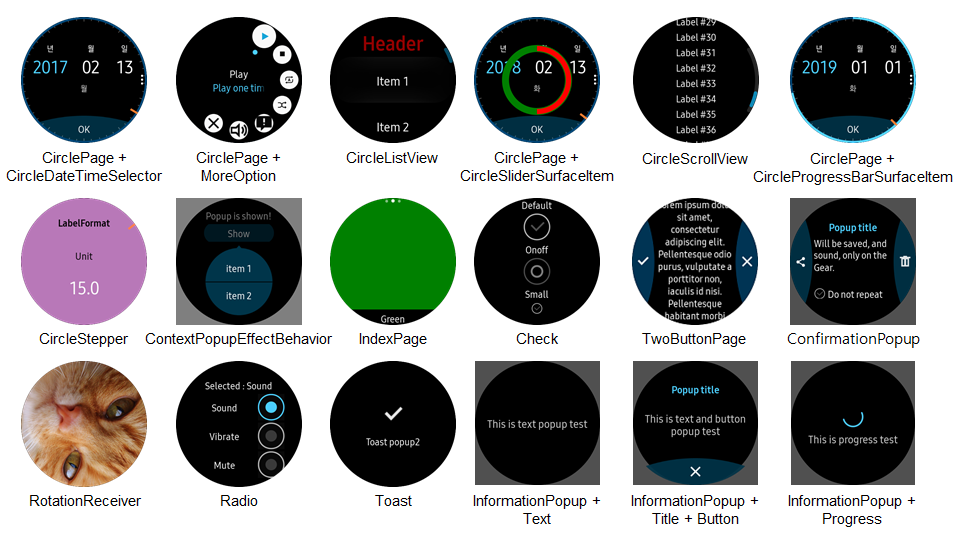

# Wearable Circular UI

The Wearable Circular UI project is a set of helpful extensions of the <a href="https://docs.microsoft.com/en-us/xamarin/xamarin-forms/" target="_blank">Xamarin.Forms</a> framework.
The aim of this project is to develop an open source software and to motivate software developers to create Tizen Wearable Xamarin.Forms application more easily and efficiently. 
The binaries are available via NuGet. The package name is <a href="https://github.com/Samsung/Tizen.CircularUI/" target="_blank">Tizen.Wearable.CircularUI</a>.

> **Note**
>
>Xamarin.Forms provides cross-platform APIs, but this project works only on the Samsung Gear device that supports Tizen .NET.

## Controls

This project provides you the following UI controls:

- **Check** : A subclass of Xamarin.Forms.Switch control that supports Tizen specific style.
- **CircleDateTimeSelector** : A control to select date or time that fits in the circular screen.
- **CircleListView** : A subclass of Xamarin.Forms.ListView control that fits in the circular screen and has the circular scrollbar.
- **CirclePage** : A subclass of Xamarin.Forms.Page that can show Circular ProgressBar and Circular Slider and the button on the bottom of the screen. it can also show MenuItems on the circular menu like MoreOption.
  - **CircleProgressBarSurfaceItem** : A control that fits in the circular screen. it can be shown in CirclePage only.
  - **CircleSliderSurfaceItem** : A Slider control that responds to the bezel action and fits in the circular screen.
- **CircleScrollView** : A subclass of Xamarin.Forms.ScrollView that can be scrolled by the bezel action.
- **CircleStackLayout** : A container to layout children linear in the circular area.
- **CircleStepper** : A control to select a number of steps that fits in the circular screen.
- **CircleSurfaceEffectBehavior** : The CircleSurfaceEffectBehavior is an effect which allows you to insert views that require CircleSurface.
- **ContextPopupEffectBehavior** : The behavior to show a small popup that has one or two button sticky with any control.
- **IndexPage** : A subclass of multiple pages that can slide child page horizontal and has dots on top of the screen for the number of child pages.
- **InformationPopup** : A popup has a control to show progress, and one button that you can set the behavior you want on the bottom side of the circular screen.
- **IRotationReceiver** : An event receiver for using the bezel action.
- **PopupEntry** : The PopupEntry is a class that extends Xamarin.Forms.Entry. It makes a new layer when editing text on the entry.
- **Radio** : A radio control.
- **Toast** : A popup for simple feedback.
- **TwoButtonPage** : A subclass of Xamarin.Forms.Page that has buttons that you can set the behavior you want on the left and right side of the circular screen.
- **TwoButtonPopup** : A popup that has buttons that you can set the behavior you want on the left and right side of the circular screen.

The following screenshot has various examples of CircularUI APIs:
  

## Prerequisite

- Visual Studio 2017
- Visual Studio Tools for Tizen
  - [How to install Visual Studio Tools for Tizen](../../../vstools/install.md)
- Tizen Wearable emulator image (supports version WEARABLE-4.0-Emulator and higher)

## How To Use CircularUI API

Refer to the following documentation, and familiarize on how to use the API:

- [Quickstart](quickstart.md)
- [API Reference](https://samsung.github.io/Tizen.CircularUI/api/index.html)
- [API Guide](https://samsung.github.io/Tizen.CircularUI/index.html)

## Sample and Test Application Using Circular UI

<table>
  <tr>
    <th>Application name</th>
    <th>Screenshot</th>
    <th>Description</th>
  </tr>
  <tr>
    <td>WearableUIGallery</td>
    <td></td>
    <td>This application was created to check the basic behavior of CircularUI API. It contains all the controls of the CircularUI API, and the functions of each control consist of one TC or several TCs depending on the characteristics of the control. 
    - Install guide : sdb install org.tizen.example.WearableUIGallery.Tizen.Wearable-1.0.0.tpk  
    <a href="https://github.com/Samsung/Tizen.CircularUI/tree/master/test/WearableUIGallery">Source</a></td>
  </tr>
  <tr>
    <td>SimpleTextWatchface</td>
    <td></td>
    <td>This application was created to check the default behavior of the Watchface API.  
    - Install guide : sdb install org.tizen.example.SimpleTextWatchface-1.0.0.tpk  
    - Test guide :  
    1) Touch and hold on Watchface of Main page.  
    2) Move to left on watchface list and select SimpleTextWatchface icon.  
    3) You can see `SimpleTextWatchface` on Watchface of Main page.  
        <a href="https://github.com/Samsung/Tizen.CircularUI/tree/master/test/SimpleTextWatchface">Source</a> </td>
  </tr>
  <tr>
    <td>XUIComponents</td>
    <td></td>
    <td>This application is similar to the UIComponents application using the native API. The functions of each control consist of several test cases depending on the characteristics of the control.  
    - Install guide : sdb install org.tizen.example.UIComponents.Tizen.Wearable-1.0.0.tpk  
        <a href="https://github.com/Samsung/Tizen.CircularUI/tree/master/sample/XUIComponents">Source</a></td>
  </tr>
</table>

## Tip and Tech

- [Localization](../internationalization/localization.md) : This guide describes how to support multiple languages.

## Related Information

- Dependencies
  - Tizen 4.0 and Higher
