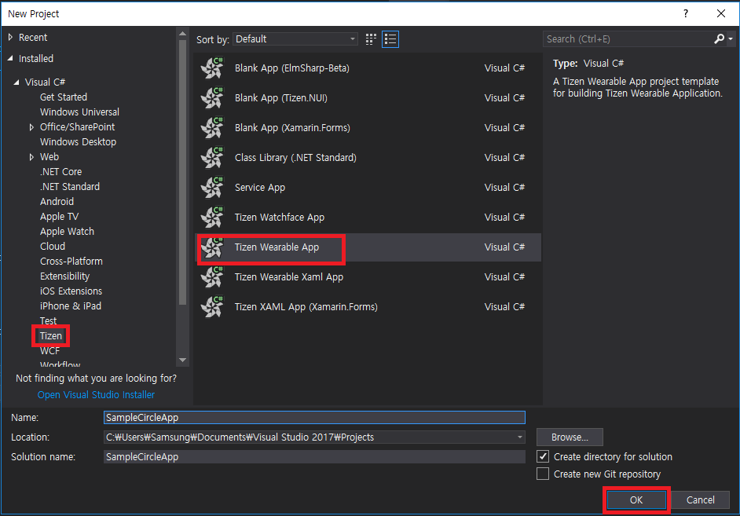
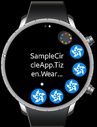
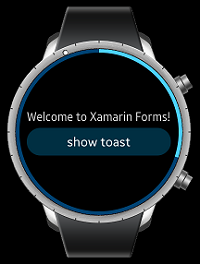

# Quickstart

This guide explains how to create an application using **Toast** and **CircleSlider** UI contols. 

- When you press the button, **Toast** pops up and it automatically disappears when the timer timeout (in seconds).
- When you rotate the bezel of Tizen wearable device, **CircleSlider** bar moves either in forward or in backward direction.

## Prerequisite

- Visual Studio
- [Visual Studio tools for Tizen](../../../vstools/install.md)

## Set Up Development Environment and Create Project

Following are the steps to create a Tizen Wearable App Template:

- [Create Project](#create-project)
- [Insert CircularUI Control Code](#insert-circularui-control-code)
- [Build and Launch Your Application](#build-and-launch-your-application)

### Create Project

In **New project** menu, select **Tizen** > **Tizen Wearable App**. Click **OK**.
    

You can use APIs of Xamarin.Forms and Tizen.Wearable.CircularUI now.
    

   > **Note**
   >
   > For more **Tizen Wearable XAML App template** information, see [Tizen Wearable XAML App template](quickstart_tizenxamlapptemplate.md).

### Insert CircularUI Control Code

In **App.cs** file, add the following code. This code defines the user interface for the page and displays Toast popup during three seconds:

   **App.cs** file
   ```cs
    using System;

    using Xamarin.Forms;
    using Tizen.Wearable.CircularUI.Forms;

    namespace SampleCircleApp
    {
        public class App : Application
        {
            public App()
            {
                Button btn = new Button { Text = "show toast" };
                btn.Clicked += OnButtonClicked;

                CircleSliderSurfaceItem circleSlider = new CircleSliderSurfaceItem() {
                    Increment = 0.5,
                    IsVisible = true,
                    Maximum = 15,
                    Minimum = 0,
                    Value = 3,
                };

                // The root page of your application
                CirclePage circlePage = new CirclePage() {
                    Content = new StackLayout {
                        HorizontalOptions = LayoutOptions.Center,
                        VerticalOptions = LayoutOptions.Center,
                        Orientation = StackOrientation.Vertical,
                        Children = {
                            new Label {
                                HorizontalTextAlignment = TextAlignment.Center,
                                Text = "Welcome to Xamarin Forms!"
                            },
                            btn
                        }
                    },
                };
                circlePage.CircleSurfaceItems.Add(circleSlider);
                circlePage.RotaryFocusObject = circleSlider;
                MainPage = circlePage;
            }

            private void OnButtonClicked(object sender, EventArgs e)
            {
                Toast.DisplayText("Toast popup", 3000);
            }
            ...
        }
    }

   ```

- **CirclePage** derived from `Xamarin.Forms.Page`. This page content area has **Label** and **Button**.
    For more information, see [CirclePage guide](https://samsung.github.io/Tizen.CircularUI/guide/CirclePage.html).
- `circlePage.CircleSurfaceItems.Add()` : **CircleSliderSurfaceItem** is attached to **CircleSurfaceItem** of  **CirclePage**.
- `RotaryFocusObject` : is set reference of the `circleSlider`. **CircleSliderSurfaceItem** has rotary focus. It can receive a Rotary Event from the wearable device's bezel interaction.
- `OnButtonClicked` : is an event handler of `Button` `Clicked` event.

### Build and Launch Your Application

1. Build the solution
    - In the Visual Studio menu, select **Build** > **Build Solution**.
    - In the Solution Explorer view, right-click the solution name and select **Build**.

2. Launch Tizen Emulator

    - Click **Launch Tizen Emulator** button.

        

    - Select your device type and click **Launch** button, as displayed in the following image:
        

3. Copy the application

    For Windows OS, copy the application tpk file from the project binary path to sdb tool path.
    - `SampleCircleApp` tpk file is located in `ProjectPath\SampleCircleApp\SampleCircleApp\bin\Debug\tizen40\org.tizen.example.SampleCircleApp-1.0.0.tpk`.
    - To locate the project path, in the Solution Explorer view, right-click the solution name and click **open folder in file explorer**.
    - SDB tool is located in `c:\tizen\tools\sdb.exe`.

4. Launch Tizen SDB command prompt

    - For Windows OS, launch Tizen SDB command prompt (**Tool** > **Tizen** > **Tizen Sdb Command Prompt**).
    - For Linux, you can use SDB command directly in your project path.

5. Install your application with SDB command

    ```
    sdb install org.tizen.example.SampleCircleApp-1.0.0.tpk
    ```
6. Launch wearable emulator to verify the application

    

    

## Related Information

- Dependencies
  - Tizen 4.0 and Higher
